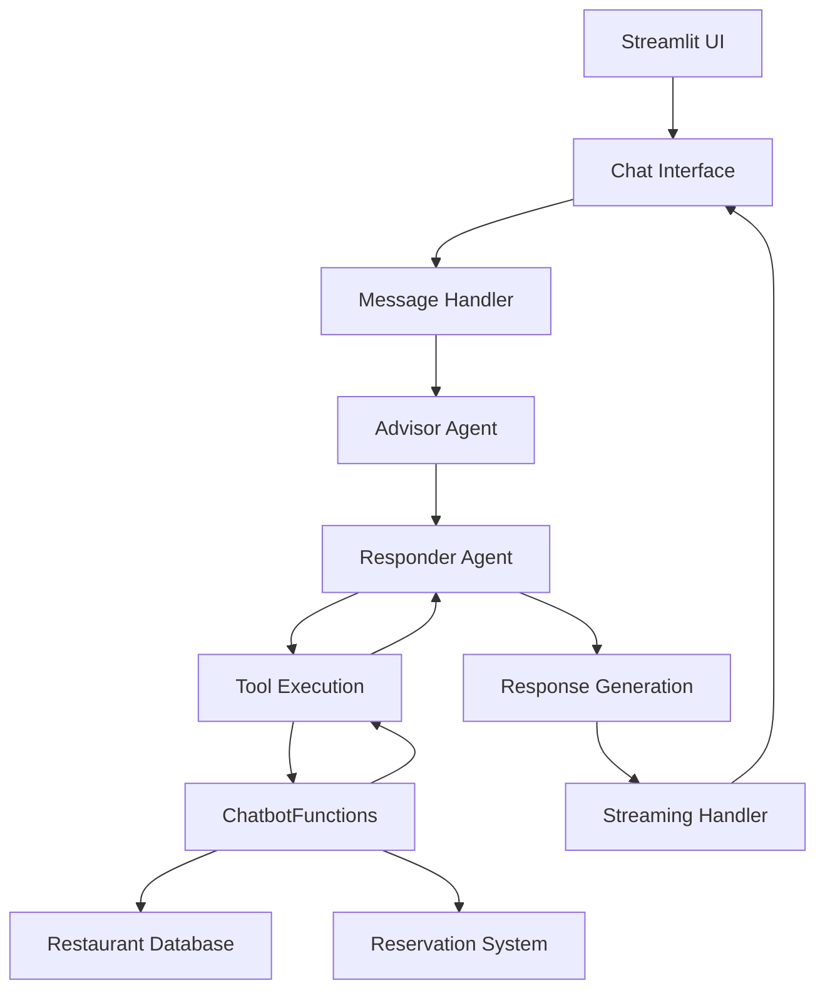

# FoodieSpot Chatbot - DineMate AI Assistant

  

An intelligent restaurant assistant chatbot for the FoodieSpot chain in Bengaluru, featuring real-time streaming responses, persistent conversation threads, and sophisticated tool integration for restaurant discovery and reservations.

## 👨🏻‍💻Author

- [Haris Javed](github.com/harisj58)

## 🚀 Key Features

### Core Capabilities

- **Intelligent Restaurant Discovery**: Location-based restaurant recommendations with fuzzy matching
- **Multi-Modal Search**: Find restaurants by area, cuisine type, or ambience preferences
- **Real-Time Reservations**: Complete booking system with validation and persistence
- **Streaming Responses**: Real-time AI responses with visual loading indicators
- **Thread Management**: Persistent conversation history with automatic title generation
- **Tool Call Optimization**: Advanced advisor system for intelligent function calling

### Technical Highlights

- **Local/Remote AI Processing**: Runs entirely on local infrastructure using Ollama but can also make use of a remote server serving LLM using Ollama
- **Advanced Prompt Engineering**: Multi-agent architecture with specialized advisor
- **Fuzzy Matching**: 70% confidence threshold for robust location and preference matching
- **Context Management**: Intelligent conversation window management to prevent token overflow
- **Error Recovery**: Comprehensive error handling with graceful fallbacks

## 📄 Use Case Document

A supplementary use case document for this project can be found [here](https://www.notion.so/FoodieSpot-Chatbot-Use-Case-Document-1ff25bd20728802495b5d47fab28d8ae).

## 📋 Prerequisites

### System Requirements

- **Python**: 3.12 or higher
- **Memory**: Minimum 8GB RAM (16GB recommended for optimal performance)
- **Storage**: ~20GB free space for model files and environment
- **OS**: Windows 10+, macOS 10.15+, or Linux

### Required Software

1.  **Ollama**: AI model runtime
2.  **Git**: Version control (for cloning repository)
3.  **uv**: An extremely fast Python package and project manager, written in Rust

## 🛠️ Installation & Setup

### 1. Install Prerequisites

Intsall the above mentioned prerequisites for your OS. Please note that this software was designed on a Linux machine.

### 2. Pull the model

```bash
ollama pull qwen3:8b-fp16
```

### 3. Clone the repository

```bash
git clone https://github.com/harisj58/foodiespot-chatbot
cd foodiespot-chatbot
```

### 4. Configure Environment

Create a `.env` file in the project root (refer to `.env.example`):

```env
LLM_BASE_URL=http://localhost:11434
```

### 5. Setup `uv` project

- To create a `uv` based virtual environment, run:

```bash
uv venv
```

- To install all required dependencies, use:

```bash
uv sync
```

### 6. Activate the environment

```bash
source .venv/bin/activate
```

### 7. Run the application

```bash
streamlit run chatbot.py
```

The application will be available at `http://localhost:8501`

## 🎯 Business Strategy & Value Proposition

### Market Positioning

FoodieSpot Chatbot addresses the growing demand for conversational AI in hospitality, providing customers with an intuitive, natural language interface for restaurant discovery and booking.

### Key Business Benefits

**For Customers:**

- **Personalized Discovery**: AI-powered recommendations based on location, cuisine, and ambience preferences
- **Seamless Booking**: Complete reservation process through natural conversation
- **24/7 Availability**: Round-the-clock assistance without human intervention
- **Context Retention**: Persistent conversation history across sessions

**For Restaurant Chain:**

- **Operational Efficiency**: Automated reservation handling reduces staff workload
- **Customer Insights**: Conversation analytics reveal preferences and booking patterns
- **Scalability**: Single system handles unlimited concurrent users
- **Cost Reduction**: Reduced need for phone-based reservation staff

### Competitive Advantages

1.  **Local AI Processing**: No data leaves premises, ensuring privacy and reducing latency (optional)
2.  **Multi-Modal Search**: Unique combination of location, cuisine, and ambience filtering
3.  **Conversation Continuity**: Thread-based system maintains context across sessions
4.  **Real-Time Streaming**: Enhanced user experience with live response generation

## 🔧 Prompt Engineering Architecture

### Multi-Agent System Design

The chatbot employs a sophisticated two-agent architecture that separates concerns for optimal performance:

#### Responder Agent (DineMate)

**Role**: Customer-facing restaurant assistant

**Responsibilities**:

- Direct customer interaction and response generation
- Tool execution and result interpretation
- Reservation management and validation
- Context-aware conversation flow

**Key Prompt Engineering Techniques**:

- **Role Definition**: Clear identity as "DineMate, restaurant assistant for FoodieSpot"
- **Constraint Enforcement**: Strict rules preventing information fabrication
- **Progressive Disclosure**: Guided conversation flow from greeting to reservation
- **Error Prevention**: Explicit instructions to always use tools before responding

#### Advisor Agent (Tool Call Advisor)

**Role**: Behind-the-scenes analysis and optimization

**Responsibilities**:

- Conversation context analysis
- Tool call recommendation generation
- Decision support for responder agent

**Advanced Techniques**:

- **Context Window Management**: Analyzes last 6 messages for optimal recommendations
- **Sequential Logic**: Understands conversation progression patterns
- **Tool Optimization**: Prevents unnecessary or redundant function calls

### Context Management Strategy

```python
# Intelligent context limitation
CONTEXT_WINDOW_LIMIT = 20  # Prevent token overflow
ADVISOR_CONTEXT_LIMIT = 6   # Focused analysis window
```

**Benefits**:

- Prevents model degradation from excessive context
- Maintains conversation coherence
- Optimizes response generation speed

### Streaming Response Architecture

The system implements sophisticated streaming with visual feedback:

1.  **Analysis Phase**: "🤖 Analyzing conversation context..."
2.  **Tool Execution**: "🔧 Executing tools... (Call #1)"
3.  **Response Generation**: Real-time content streaming with shimmer effects

## 💬 Example Conversations

You can either run the app locally or inspect the files in the `threads/` directory to examine example conversations.

## 🏗️ Technical Architecture

### System Components



### Data Flow

1.  **User Input**: Captured via Streamlit chat interface
2.  **Context Analysis**: Advisor agent analyzes conversation history
3.  **Tool Recommendations**: Generated based on context and user intent
4.  **Primary Processing**: Responder agent processes with tool guidance
5.  **Tool Execution**: Functions called as needed for data retrieval
6.  **Response Generation**: Streaming response with real-time updates
7.  **Persistence**: Thread and reservation data saved automatically

### Key Technical Decisions

**Local/Remote AI Processing**

- **Rationale**: Data privacy, reduced latency, cost control
- **Trade-off**: Higher setup complexity vs. enhanced security

**Fuzzy Matching**

- **Implementation**: RapidFuzz with 70% confidence threshold
- **Benefit**: Handles typos and variations in location names

**Thread-Based Architecture**

- **Advantage**: Maintains conversation context across sessions
- **Storage**: Local JSON files for simplicity and portability
-

## 🚧 Current Limitations

### Technical Constraints

1.  **Single City Support**: Currently limited to Bengaluru locations
2.  **Manual Data Updates**: Restaurant information requires manual JSON updates
3.  **No Real-Time Integration**: No connection to actual POS or booking systems
4.  **Local Model Dependency**: Requires Ollama installation and maintenance

### Functional Limitations

1.  **No Payment Processing**: Reservations don't include payment handling
2.  **No Cancellation System**: Users cannot modify or cancel bookings through chat
3.  **No Waitlist Management**: No automatic handling of fully booked slots
4.  **Limited Analytics**: Basic conversation metrics only

### Scalability Considerations

1.  **Hardware Requirements**: Significant RAM and CPU needs for local AI
2.  **Storage Growth**: Thread history grows indefinitely without archiving
3.  **Model Updates**: Manual process for updating AI models

## 🛣️ Future Enhancements

### Short-Term (3-6 months)

- **Multi-City Expansion**: Support for additional metropolitan areas
- **Reservation Management**: Modify, cancel, and reschedule bookings
- **Wait List Integration**: Automatic notification for table availability
- **Menu Integration**: Show current menus and prices
- **Review System**: Collect and display customer feedback
- **Generative UI**: Interactive I/O widgets for better UX

### Medium-Term (6-12 months)

- **Payment Integration**: Complete booking with payment processing
- **Real-Time Availability**: Live table status integration
- **Advanced Analytics**: Customer preference analysis and reporting
- **Mobile App**: Native iOS/Android applications
- **Voice Interface**: Speech-to-text and text-to-speech capabilities

### Long-Term (1+ years)

- **Multi-Language Support**: Regional language interfaces
- **Predictive Booking**: AI-suggested optimal booking times
- **Loyalty Program**: Integrated rewards and point systems
- **Group Booking**: Large party and event reservation handling
- **Cloud Deployment**: Enterprise-ready cloud infrastructure
